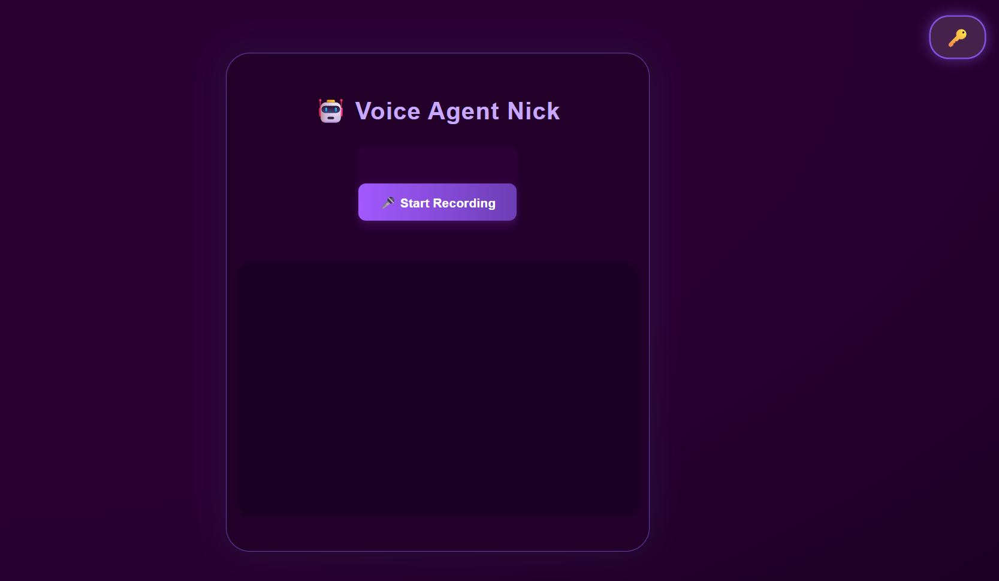

# 🤖 Voice Agent Nick: Your Real-Time Voice AI Companion

Welcome to **Voice Agent Nick**! Nick is your friendly, emotionally intelligent voice assistant. He listens, responds with warmth, and chats in real-time—all in your browser.

Let Nick brighten your day with cozy conversations, live weather updates, real-time web search, and a sprinkle of personality! 💜

---

## ✨ Features You'll Love

<br>

### 🎤 Real-Time Voice Chat
Speak to Nick, and he replies instantly with his own voice.

### 🧠 Gemini LLM Integration
Persona-aware, thoughtful replies.

### 🔊 Murf TTS Voice
Streamed audio responses in Nick's unique voice.

### 🎧 AssemblyAI (Speech-to-Text)
Accurate transcription of your speech.

### 🌦️ Live Weather Updates
Nick fetches real-time weather for you.

### 🔎 Tavily Web Search
Ask questions—Nick will search the web for you.

### 🗝️ Private API Entry
Enter your keys safely—Nick never stores them.

### 🌐 Shareable & Secure
Deployed via HTTPS (Render.com) for safe sharing.

### 💜 Modern UI
Beautiful, dark-themed chat interface.

---

# 🖼️ Nick UI Sneak Peek



---

# 🌟 What's New?

<br>

- Modern dark UI with glowing chat container
- API key modal for user privacy
- Responsive design for desktop & mobile
- Streamed TTS audio replies
- Multi-API support (Gemini, Murf, AssemblyAI, Tavily, Weather)

---

# 🏗️ Architecture Overview

<br>

**Frontend:**  
HTML, CSS, JavaScript (`static/index.html`, `static/main.js`)

**Backend:**  
FastAPI (Python), Murf TTS, Gemini LLM, AssemblyAI, WeatherAPI, Tavily

---

# 🛠️ How to Use

<br>

## 🚀 Try Nick Instantly
Nick is live & ready to chat on Render : https://voice-agent-nick-6.onrender.com/

Just open the link, enter your API keys, and say hello!

## 🏡 Run Nick Locally
1. **Clone the repo:**
   ```bash
   git clone https://github.com/prabhukd/Voice-Agent-Nick-.git
   cd Voice-Agent-Nick-
   ```
2. **Install dependencies:**
   ```bash
   pip install -r requirements.txt
   ```
3. **Start the backend server:**
   ```bash
   uvicorn main:app --host 0.0.0.0 --port 10000
   ```
4. **Open Nick in your browser:**
   [http://localhost:10000](http://localhost:10000/)

## 🔑 API Keys Needed

- Gemini (chat LLM)
- AssemblyAI (speech-to-text)
- Murf (text-to-speech)
- WeatherAPI (weather info)
- Tavily (web search)

Enter these in the modal when prompted. Nick doesn’t store them—they’re used just for your current session!

---

# 📡 Nick's Endpoints

| Endpoint | Description |
|----------|-------------|
| `POST /process-audio/{session_id}` | Upload voice, get reply with audio |
| `GET /stream-murf-tts/{session_id}` | Stream Murf TTS audio |
| `GET /static/index.html` | Serve frontend |

---

# 📄 License

MIT License. Use, remix, and make your own AI friend!

---

Made with 💜 by prabhukd and Nick.

# Voice-Agent-Nick-
Nick is a lightweight, modular voice agent built with FastAPI, designed to handle real-time voice interactions, API queries, and smart automation tasks. Whether you're asking for weather updates, triggering workflows, or fetching contextual data via Tavily or other APIs, Nick responds with speed and clarity.
=======
# Conversational Voice Agent

## Overview
This project is a modern, web-based Conversational Voice Agent that allows users to interact with an AI assistant using voice. The agent transcribes speech, generates intelligent responses using a Large Language Model (LLM), and replies with natural-sounding AI voice.

## Features
- 🎤 **Voice Recording**: Record your question or message directly in the browser.
- 🧠 **AI Conversation**: Uses Google Gemini LLM to generate smart, context-aware responses.
- 🗣️ **AI Voice Response**: Converts the AI's reply to natural speech using Murf API.
- 📝 **Chat History**: Displays a session-based chat history for each conversation.
- ⚡ **Fallback Handling**: Robust error handling with browser TTS fallback if APIs fail.
- ✨ **Modern UI**: Responsive, animated, and visually appealing interface.

## Tech Stack
- **Frontend**: HTML, CSS, JavaScript (Vanilla)
- **Backend**: Python (FastAPI)
- **APIs**:
  - [AssemblyAI](https://www.assemblyai.com/) (Speech-to-Text)
  - [Google Gemini](https://ai.google.dev/) (LLM)
  - [Murf](https://murf.ai/) (Text-to-Speech)

## Architecture
- **Frontend**: Single-page app served from `/static/index.html`. Handles recording, UI updates, and fetches to backend.
- **Backend**: FastAPI server with endpoints for audio upload, transcription, LLM query, TTS, and chat history. Handles session management and error fallback.
- **Session Management**: Each browser session gets a unique ID for chat history.
- **Error Handling**: If any API fails, the agent falls back to browser TTS and displays a helpful message.

## Setup & Running
1. **Clone the repository**
   ```bash
   git clone <your-repo-url>
   cd Murf
   ```
2. **Install dependencies**
   ```bash
   pip install -r requirements.txt
   ```
3. **Set API Keys**
   - In `main.py`, set these variables:
     - `ASSEMBLYAI_API_KEY`
     - `MURF_API_KEY`
     - `GEMINI_API_KEY`
   - Or set them as environment variables:
     ```bash
     set ASSEMBLYAI_API_KEY=your_key
     set MURF_API_KEY=your_key
     set GEMINI_API_KEY=your_key
     ```
4. **Run the FastAPI server**
   ```bash
   uvicorn main:app --reload --port 8000
   ```
5. **Open the app**
   - Go to [http://127.0.0.1:8000](http://127.0.0.1:8000) in your browser.

## Environment Variables
- `ASSEMBLYAI_API_KEY`: Your AssemblyAI API key
- `MURF_API_KEY`: Your Murf API key
- `GEMINI_API_KEY`: Your Google Gemini API key

## Capabilities
- Real-time voice-to-voice AI conversation
- Session-based chat history
- Robust error handling and fallback
- Modern, animated UI

## How it Works
1. User clicks the record button and speaks.
2. Audio is sent to the backend, transcribed using AssemblyAI.
3. Transcription is sent to Gemini LLM for a response.
4. LLM response is converted to speech using Murf API.
5. Audio reply is played in the browser and chat history is updated.
6. If any step fails, browser TTS is used for fallback.

## License
MIT

---

*For questions or support, open an issue or contact the maintainer.*

